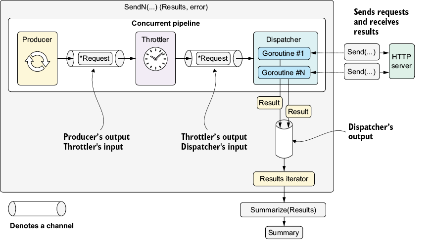

* Configure VS Code Debug: press `Ctrl+Shift+D`  to create  `.vscode\launch.json`
  ```json
  {
        // Use IntelliSense to learn about possible attributes.
        // Hover to view descriptions of existing attributes.
        // For more information, visit: https://go.microsoft.com/fwlink/?linkid=830387
        "version": "0.2.0",
        "configurations": [
        {
            "name": "GO-Launch Main",
            "type": "go",
            "request": "launch",
            "mode": "debug",
            "program": "${workspaceFolder}/url/cmd", 
            "cwd": "${workspaceFolder}",
            "env": {},
            "args": []
        }
        ]
  }
  ```
  * `${workspaceFolder}`: `06-synchronous-apis-for-concurrency\06-concurrent-pipeline-pattern`
  * Install Delve (Go Debugger)
    ```bash
    go install github.com/go-delve/delve/cmd/dlv@latest
    ```
* In `VSCode` press `Ctrl+Shift+P` ,and then type `Go: Locate Configured Go Tools`
* Clean old compiling cache
  ```bash
  go clean -cache -modcache -testcache -fuzzcache
  ```
* Clean old pkg
  ```bash
  rmdir /s /q "%GOROOT%\pkg"
  ```   

 
# 6 Synchronous APIs for concurrency
## 6.6 Concurrent pipeline pattern
### 6.6.1 Benefits of concurrent pipelines
The concurrent pipeline pattern has the following benefits:
* Flexibility—It’s easier to add or remove stages without modifying their code.
* Reusability—We can reuse parts in different pipelines and programs.
* Modularity—Stages are separate and focused, making them easier to maintain.

### 6.6.2 Designing a concurrent pipeline
* Producer—Produces and delivers *Request messages to the next stage
* Throttler—Slows the passage of each *Request in the pipeline if activated
* Dispatcher—Spawns goroutines that send HTTP requests and collect results
> [!NOTE]
>  The following sections require basic knowledge of concurrent programming in Go. Check out appendix E for details on goroutines and channels.

   
Figure 6.3 `SendN` runs the pipeline and returns a `Results` iterator. Stages run concurrently and are connected through channels. Dispatcher goroutines call the configured `Send` function to send concurrent HTTP requests and return results.