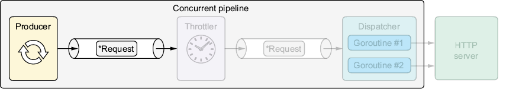

* Configure VS Code Debug: press `Ctrl+Shift+D`  to create  `.vscode\launch.json`
  ```json
  {
        // Use IntelliSense to learn about possible attributes.
        // Hover to view descriptions of existing attributes.
        // For more information, visit: https://go.microsoft.com/fwlink/?linkid=830387
        "version": "0.2.0",
        "configurations": [
        {
            "name": "GO-Launch Main",
            "type": "go",
            "request": "launch",
            "mode": "debug",
            "program": "${workspaceFolder}/url/cmd", 
            "cwd": "${workspaceFolder}",
            "env": {},
            "args": []
        }
        ]
  }
  ```
  * `${workspaceFolder}`: `06-synchronous-apis-for-concurrency\07-producer-stage`
  * Install Delve (Go Debugger)
    ```bash
    go install github.com/go-delve/delve/cmd/dlv@latest
    ```
* In `VSCode` press `Ctrl+Shift+P` ,and then type `Go: Locate Configured Go Tools`
* Clean old compiling cache
  ```bash
  go clean -cache -modcache -testcache -fuzzcache
  ```
* Clean old pkg
  ```bash
  rmdir /s /q "%GOROOT%\pkg"
  ```   

 
# 6 Synchronous APIs for concurrency
## 6.7 Producer stage 
    
Figure 6.4 The producer sends messages to the next stage.

As figure 6.4 shows, the producer stage sends each `*Request` to the next stage through its output channel as many times as the number of configured HTTP requests it needs to send.

### 6.7.1 Implementation
> [!TIP]
>  See appendix E for more on coordinating goroutines by closing channels.

- [Listing 6.12: Implementing the producer stage](../../all-listings/06-synchronous-apis-for-concurrency/12-implementing-the-producer-stage.md)

> [!NOTE]
> Directional channels (send-only and receive-only) make introducing bugs less likely and clarify our intentions as to what to do (and what we cannot and should not do) with a channel. See appendix E for details.


### 6.7.2 Integration
- [Listing 6.13: Integrating the producer stage](../../all-listings/06-synchronous-apis-for-concurrency/13-integrating-the-producer-stage.md)