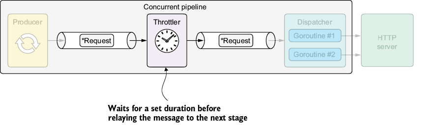

* Configure VS Code Debug: press `Ctrl+Shift+D`  to create  `.vscode\launch.json`
  ```json
  {
        // Use IntelliSense to learn about possible attributes.
        // Hover to view descriptions of existing attributes.
        // For more information, visit: https://go.microsoft.com/fwlink/?linkid=830387
        "version": "0.2.0",
        "configurations": [
        {
            "name": "GO-Launch Main",
            "type": "go",
            "request": "launch",
            "mode": "debug",
            "program": "${workspaceFolder}/url/cmd", 
            "cwd": "${workspaceFolder}",
            "env": {},
            "args": []
        }
        ]
  }
  ```
  * `${workspaceFolder}`: `06-synchronous-apis-for-concurrency\08-throttler-stage`
  * Install Delve (Go Debugger)
    ```bash
    go install github.com/go-delve/delve/cmd/dlv@latest
    ```
* In `VSCode` press `Ctrl+Shift+P` ,and then type `Go: Locate Configured Go Tools`
* Clean old compiling cache
  ```bash
  go clean -cache -modcache -testcache -fuzzcache
  ```
* Clean old pkg
  ```bash
  rmdir /s /q "%GOROOT%\pkg"
  ```   

 
# 6 Synchronous APIs for concurrency
## 6.8 Throttler stage
    
Figure 6.5 The throttler stage slows the flow of messages in the pipeline.
 
### 6.8.1 Implementation

- [Listing 6.14: Implementing the throttler stage](../../all-listings/06-synchronous-apis-for-concurrency/14-implementing-the-throttler-stage.md)

> [!NOTE]
> In early versions of Go, not closing a `Ticker` caused a goroutine leak. As of Go 1.23, closing a `Ticker` is unnecessary because Go can do that for us.
### 6.8.2 Integration
- [Listing 6.15: Integrating the throttler stage](../../all-listings/06-synchronous-apis-for-concurrency/15-integrating-the-throttler-stage.md)