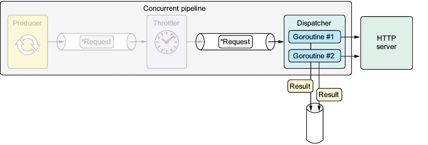

* Configure VS Code Debug: press `Ctrl+Shift+D`  to create  `.vscode\launch.json`
  ```json
  {
        // Use IntelliSense to learn about possible attributes.
        // Hover to view descriptions of existing attributes.
        // For more information, visit: https://go.microsoft.com/fwlink/?linkid=830387
        "version": "0.2.0",
        "configurations": [
        {
            "name": "GO-Launch Main",
            "type": "go",
            "request": "launch",
            "mode": "debug",
            "program": "${workspaceFolder}/url/cmd", 
            "cwd": "${workspaceFolder}",
            "env": {},
            "args": []
        }
        ]
  }
  ```
  * `${workspaceFolder}`: `06-synchronous-apis-for-concurrency\08-throttler-stage`
  * Install Delve (Go Debugger)
    ```bash
    go install github.com/go-delve/delve/cmd/dlv@latest
    ```
* In `VSCode` press `Ctrl+Shift+P` ,and then type `Go: Locate Configured Go Tools`
* Clean old compiling cache
  ```bash
  go clean -cache -modcache -testcache -fuzzcache
  ```
* Clean old pkg
  ```bash
  rmdir /s /q "%GOROOT%\pkg"
  ```   

 
# 6 Synchronous APIs for concurrency
## 6.9 Dispatcher stage
    
Figure 6.6 The dispatcher goroutines send HTTP requests, process HTTP responses, calculate a `Result`, and deliver `Results` to the dispatcher’s output channel.
 
### 6.9.1 Implementation
- [Listing 6.16: Implementing the dispatcher](../../all-listings/06-synchronous-apis-for-concurrency/16-implementing-the-dispatcher.md)
> [!TIP]
> See appendix E for more information about the WaitGroup type.
> [!TIP]
> See appendix E for an approach that uses buffered channels to limit concurrency.

### 6.9.2 Integration

- [Listing 6.17: Integrating the dispatcher stage](../../all-listings/06-synchronous-apis-for-concurrency/17-integrating-the-dispatcher-stage.md)
- [Listing 6.18: Updating the iterator to run the pipeline](../../all-listings/06-synchronous-apis-for-concurrency/18-updating-the-iterator-to-run-the-pipeline.md)

> [!TIP]
> See appendix E for details on goroutine leaks and how to prevent them.

### 6.9.3 Demonstration
First, we’ll send 100 requests without concurrency (with a single worker). This process will take around 10 seconds because the pipeline handles requests sequentially, and the worker calls the `Send` function, which sleeps for 100 ms. It’s similar to the behavior before applying concurrency:
```bash
$ go run ./hit/cmd/hit -n 100 -c 1 https://x.com/inancgumus
. . .
Sending 100 requests to "https://x.com/inancgumus" (concurrency: 1)
Summary:
    Success:  100%
    RPS:      10.0
    Requests: 100
    Errors:   0
    Bytes:    1000
    Duration: 10.116s
    Fastest:  100ms
    Slowest:  100ms
```
Next, we’ll send the same number of requests but with 10 workers. This change should speed the process by a factor of 10, completing the run in just over 1 second:
```bash
$ go run ./hit/cmd/hit -n 100 -c 10 https://x.com/inancgumus
. . .
Sending 100 requests to "https://x.com/inancgumus" (concurrency: 10)

Summary:
    Success:  100%
    RPS:      99.0
    Requests: 100
    Errors:   0
    Bytes:    1000
    Duration: 1.012s
    Fastest:  100ms
    Slowest:  100ms
```    
For the final simulation, we’ll activate the RPS option, limiting the rate to 25 requests per second. With 10 workers running concurrently, the process should take ~4 seconds:
```bash
$ go run ./hit/cmd/hit -n 100 -c 10 -rps 25 http://example.com
. . .
Sending 100 requests to "http://example.com" (concurrency: 10)

Summary:
    Success:  100%
    RPS:      25.0
    Requests: 100
    Errors:   0
    Bytes:    1000
    Duration: 4.102s
    Fastest:  100ms
    Slowest:  100ms
```  

> [!TIP]
> Maximizing concurrency doesn’t always mean more speed. See https://research.cs.wisc.edu/multifacet/papers/ieeecomputer08_amdahl_multicore.pdf for more information.