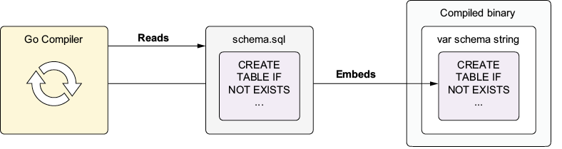

* Configure VS Code Debug: press `Ctrl+Shift+D`  to create  `.vscode\launch.json`
  ```json
  {
        // Use IntelliSense to learn about possible attributes.
        // Hover to view descriptions of existing attributes.
        // For more information, visit: https://go.microsoft.com/fwlink/?linkid=830387
        "version": "0.2.0",
        "configurations": [
        {
            "name": "GO-Launch Main",
            "type": "go",
            "request": "launch",
            "mode": "debug",
            "program": "${workspaceFolder}/link/cmd/linkd", 
            "cwd": "${workspaceFolder}",
            "env": {},
            "args": []
        }
        ]
  }
  ```
  * `${workspaceFolder}`: `10-polymorphic-storage\01-interacting-with-sql-databases`
  * Install Delve (Go Debugger)
    ```bash
    go install github.com/go-delve/delve/cmd/dlv@latest
    ```
* In `VSCode` press `Ctrl+Shift+P` ,and then type `Go: Locate Configured Go Tools`
* Clean old compiling cache
  ```bash
  go clean -cache -modcache -testcache -fuzzcache
  ```
* Clean old pkg
  ```bash
  rmdir /s /q "%GOROOT%\pkg"
  ```   

 
# 10 Polymorphic storage
## 10.1 Interacting with SQL databases
Go provides two packages to interact with a specific SQL (or row-oriented) database:
* `database/sql` provides a uniform API to interact with various SQL databases.
* `database/sql/driver` defines behaviors that database drivers must implement.
> [!NOTE] 
> Unless we implement a driver, we use the `sql` package.
The sql package relies on community-provided and open source driver packages to interact with a specific SQL database. As figure 10.1 shows, after we download a driver and register it in the `sql` package, we can start interacting with the database using the `sql` package’s API, such as the `Open` function. It returns a `*sql.DB` handle to interact with the database, such as executing SQL queries and returning results.

  
Figure 10.1 The sql package abstracts underlying databases with drivers. The sql package’s registry stores registered drivers, and *DB manages a connection pool.

The Open function looks like this:
```golang
func Open(  #1
    driverName string, dataSourceName string,   #1
) (*sql.DB, error)  #1
```
#1 Returns an *sql.DB handle for the specified driver name

It queries the registry and returns a `*DB` if the driver is registered. The first argument to `Open` is the driver’s name (e.g., `sqlite`). The second one is the driver-specific connection string (e.g., `file:links.db`). The following returns a `*DB` for interacting with an SQLite database:
```golang
db, err := sql.Open("sqlite", "file:links.db")
```
Or this one for PostgreSQL:
```golang
db, err := sql.Open("postgres", "dbname=links sslmode=disable")
```
The returned `*DB` manages a connection pool that simplifies database operations because we don’t need to manage each connection (e.g., connect, disconnect, or reuse it) ourselves. The pool initially contains no active connections. We work directly with `*DB` to run a query; it figures out which connection to use from the pool, establishing or closing connections as needed. `*DB` also handles features like autoretries on failures, making our code more robust.

`DB` is a concrete type offering polymorphism through the `driver` interfaces without being an interface type itself. This approach allows the `DB` type to provide new features without breaking existing code. See the following sidebar for details on the driver pattern.

> [!IMPORTANT]
> DEEP DIVE: THE DRIVER DESIGN PATTERN   
> The `sql` package has an approach that uses drivers to abstract databases. Let’s explore how this approach works by examining the driver pattern, illustrated in the following figure. `DB` interacts with databases indirectly through the `sql/driver` interfaces. Drivers communicate directly with their specific database technologies to carry out our SQL queries.

  
The driver pattern abstracts SQL database communication.

### 10.1.1 Registering a driver
The `sql` package provides an abstraction layer with drivers and gives us a uniform way to interact with various SQL databases. But the standard library does not bundle an SQL driver, so calling `Open` fails if we don’t have the necessary driver. Because we want to use SQLite, let’s download and register an SQLite driver so we can get a `*DB` handle to interact with SQLite.

#### DOWNLOADING A DRIVER
We’ll use the `go get` command to download an [SQLite driver module](https://pkg.go.dev/modernc.org/sqlite) ([version 1.40.0](https://modern-c.appspot.com/-/builder/?importpath=modernc.org%2fsqlite) was the latest version when this chapter was written) and add it to our Go module:
```bash
$ go get modernc.org/sqlite@v1.40.0
```
Although we’ve downloaded an SQLite driver, we’ll write our SQL queries to be fully compatible with the PostgreSQL database. Because the `sql` package abstracts SQL databases, we could also download a PostgreSQL driver (e.g., `pq`) and run our program with PostgreSQL.

> [!TIP]
> For a list of SQL drivers, visit https://go.dev/wiki/SQLDrivers.

We’ll keep things simple with SQLite, however. We use a pure-Go SQLite driver, [`modernc.org/sqlite`](https://pkg.go.dev/modernc.org/sqlite). We could have used another one, [`mattn/go-sqlite3`](https://pkg.go.dev/github.com/mattn/go-sqlite3):
```bash
$ go get github.com/mattn/go-sqlite3
```
This driver is more performant and feature-rich than what we’re using, but it uses C bindings and requires us to enable CGO if we want to cross-compile our program:
```bash
$ CGO_ENABLED=1 go build
```
Enabling CGO complicates cross-compilation, slows builds, and introduces external dependencies. It’s best to use CGO when we don’t have any other choice or when its advantages significantly outweigh its overhead and complexity. Pick your poison carefully.

> [!NOTE]
> CGO enables Go code to call C code. You can learn more about CGO at https://go.dev/blog/cgo.

#### IMPORTING A DRIVER
Now that we’ve downloaded the driver, we must register it in the `sql` package before connecting to SQLite, as shown in the following listing. We can register the driver by importing it from our package.
- [Listing 10.1: Registering the SQLite driver](../../all-listings/10-polymorphic-storage/01-registering-the-sqlite-driver.md)

Our `sqlite` package has the same name as the `sqlite` driver package but is separate, and sharing names doesn’t lead to conflicts because the import paths are different. Naming our package `sqlite` lets us use it as an entry point and isolation layer for the rest of our packages, providing SQLite interaction through a single package without scattering SQL-specifics to the rest of our code, improving maintainability. It also helps later to have nice-to-read services such as `sqlite.Shortener`, a `Shortener` backed by SQLite.

The underscore in the `import` tells the compiler we won’t use the driver package name `sqlite` in this `sqlite.go` file, but it still allows us to register the driver. This importing use is known as a `blank` or `side-effect import`. If we skip the blank import, we see an “imported and not used” error, or our text editor removes the import, skipping driver registration.
> [!IMPORTANT]
> DEEP DIVE: BLANK IMPORTS AND INIT()   
> When we import a package, it executes any init functions declared in the package once. (Importing a package multiple times, for example, calls its init functions only once.) Drivers contain at least one init function, enabling them to register themselves automatically within the sql package’s registry. Here’s the SQLite driver’s init function:
> ```golang
> package sqlite #1
> func init() { #2
>     sql.Register("sqlite", newDriver()) #3
> }
> ```
> #1 The modernc.org/sqlite package   
> #2 Runs after the package-level variables are initialized   
> #3 Registers the driver in the sql package   
> 
> This function registers the SQLite driver in this package-level map of the sql package:
> ```golang
> package sql // database/sql
> var drivers = make(map[string]driver.Driver)  #1
> ```
> #1 Package-level variable  
> 
> We often avoid `init` functions because Go calls them implicitly. They can lead to code that is extremely challenging to wrap our heads around and maintain. But these functions can still be useful for implementing global registries as the `sql` package does. Check out https://go.dev/ref/spec#Package_initialization for more information on `init` functions.

#### KEEPING MODULE GRAPHS TIDIER
After we download the driver, our module file (`go.mod`) looks like this:
```golang
module github.com/inancgumus/gobyexample

go 1.24.2

require (
  github.com/dustin/go-humanize v1.0.1 // indirect
  . . .
  modernc.org/sqlite v1.40.0 // indirect
)
```
The `require` directives list all our module’s dependencies along with their minimum required versions. Go marks some dependencies with the `// indirect` comment. Our module’s dependencies require these modules, but our code doesn’t depend on them directly. The `sqlite` driver appears as an indirect dependency, even though our code depends on it. Mismarking it as indirect doesn’t affect functionality but may confuse us later. We don’t want to edit a go.mod file directly to prevent mistakes, however. Instead, we can run the following command to tidy our module’s dependency graph:
```bash
$ go mod tidy
```
Now the dependency graph includes the `sqlite` module as a direct dependency:
```golang
module github.com/inancgumus/gobyexample

go 1.24.2

require modernc.org/sqlite v1.40.0

require (
 github.com/dustin/go-humanize v1.0.1 // indirect
 . . .
)
```
`go mod tidy` scans our source code and synchronizes our module’s dependencies, preventing potential confusion. Visit https://go.dev/ref/mod for more details on modules.

### 10.1.2 Opening a connection pool
Figure 10.2 shows how to connect to SQLite. We use the following functionality:
* `sql.Open` checks whether the driver exists and returns a `*DB` with an empty pool.
* `DB.PingContext` connects to the database, adding the pool’s first connection.


   
Figure 10.2 Connecting to the SQLite database using Open and PingContext

Although `Open` may return an empty pool, `PingContext` adds the first connection if successful. Behind the scenes, `Open` starts a goroutine that listens for new connection requests. `PingContext` tells this goroutine to connect to the database and put the connection in the pool for reuse. Because `*DB` has a connection pool, we must maintain `*DB` throughout our program’s life cycle to avoid reconnecting to the same database for every query we send.

> [!TIP] 
> Calling `DB.Close` closes the connection pool. We rarely need to call it, however, because reusing connections from the connection pool eliminates the overhead of establishing new database connections, which involves network latency and handshakes.

Now that we know how to open a connection pool and establish a connection, we’ll add the following `Dial` function to verify the driver and connect to SQLite. `Dial` takes a data source name (DSN) that specifies how to connect to SQLite. `Open` verifies the driver’s existence in the sql package’s registry, and `DB.PingContext` checks whether we can connect to SQLite.
- [Listing 10.2: Dialing the database](../../all-listings/10-polymorphic-storage/02-dialing-the-database.md)

Now we can connect to SQLite using `Dial`, but we can’t insert a record into the database or query records from it. For those tasks, we need to define an SQL schema by running a query on the database that will create a table for storing links in the database.
> [!IMPORTANT]
> DEEP DIVE: OPTIMIZING THE CONNECTION POOL    
> DB allows us to fine-tune its connection pool’s behavior for optimal performance. The pool contains idle and in-use connections and uses an idle connection when executing a database task. If no idle connection is available, it establishes a new connection to the database and use that connection to carry on that task.
> 
> The `SetMaxOpenConns` and `SetMaxIdleConns` methods determine the maximum number of active and idle connections allowed in the pool. `SetConnMaxLifetime` and `SetConnMax­IdleTime` determine how long a connection remains reusable and idle.
> 
> Setting these values too high (or low) can lead to performance issues and inefficiencies: too many idle connections consume memory and waste resources, and too few can cause excessive connection churn. Instead of guessing these settings, optimize the pool by thoroughly testing and benchmarking, depending on your program’s usage patterns. For more details on tuning, visit https://go.dev/doc/database/manage-connections. 
> 
### 10.1.3 File embedding
Now that we can connect to the database, our next goal is defining an SQL schema before persisting links. As listing 10.3 shows, we’ll implement a schema file. When we run this schema on the database, it creates a `links` table with `short_key` and `uri` (original URL) columns. One column accepts only unique 16-character keys; the other allows URLs of any length. Uniqueness prevents key conflicts and ensures that each key maps to one URL.
- [Listing 10.3: Defining the SQL schema](../../all-listings/10-polymorphic-storage/03-defining-the-sql-schema.md)

We could include this schema in a constant in the code, but keeping it in an SQL file is more practical so our text editor can highlight and even lint the SQL syntax. Because our SQL schema is ready, we can run it to create the `links` table in the database. The question is how to execute this schema file. Instead of reading from this file, we can use a nice Go feature called `file embedding` to include the file’s content in a variable and the final compiled binary.

Figure 10.3 shows that the compiler can read the entire `schema.sql` file and embed it in the final binary. Then we can retrieve the file’s contents from a variable, such as `schema`. Its name doesn’t have to be the same as the file’s, but we’ll name it that way for consistency.

Because the SQL schema file’s content is in the binary, we can distribute our program with the schema included, so we can deploy the final binary without additional SQL files.

Listing 10.4 shows how to embed our SQL schema file in a string variable. We import the `embed` package and add a `go:embed` directive to embed the schema in the variable.


Figure 10.3 The compiler embeds the file in the compiled binary.
- [Listing 10.4: Applying the schema](../../all-listings/10-polymorphic-storage/04-applying-the-schema.md)

Before embedding the file, we must import the `embed` package to activate the compiler’s file-embedding feature so that it knows we’ll `embed` files. We use a blank import to import `embed` for its side effects. We wouldn’t do that if we used something from the embed package.

Next, we add an embed directive (`//go:embed`) to tell the compiler to embed the `schema.sql` file. The compiler reads the file’s entire content into the `schema` variable. Finally, we create the schema on the database using the `DB.ExecContext` method:
```golang
ExecContext(ctx context.Context, query string, args ...any) (Result, error)
```

`ExecContext` grabs a connection from the pool, executes the query, and returns the connection to the pool. As we see from its signature, we can pass an arbitrary number of arguments of `any` type to the method. Because we don’t need to provide parameters to the database while running the schema, we don’t need to pass parameters now.

> [!NOTE] 
> Learn more about file embedding at https://pkg.go.dev/embed.

> [!IMPORTANT]
> DEEP DIVE: MIGRATIONS    
> Although it’s fine in our case, running the schema while connecting to a database can be wasteful if we have a large number of SQL queries in the schema to execute. In such a case, we can use a tool crafted explicitly for this purpose, such as the golang-migrate tool. Instead of running it each time we connect to the database, we can migrate the schema only once.
> 
> Another way is to use the `embed.FS` type to build our schema migration solution. The compiler can embed the SQL files from the `schema` directory in the final binary with the following directive, after which we can access each via the `schemaFiles` variable:
> ```golang
> //go:embed *.sql  #1
> var schemaFiles embed.FS  #2
> . . .
> files, err := schemaFiles.ReadDir(".") #3
> . . .
> for _, schema := range files {  #4
>     . . .  #5
> }
> ```
> #1 Embeds all .sql files in the schema directory   
> #2 Provides a filesystem abstraction to access embedded files   
> #3 Reads all the files in the directory   
> #4 Loops over the files   
> #5 Applies the schema file similar to the approach in listing 10.4  
> 
> Migration tools often support `embed.FS` so we can embed the files and then deliver them to these tools to do the migration. `FS` stands for filesystem, providing an abstraction and uniform interface over different filesystems such as UNIX filesystems, zip archives, HTTP-served files, and embedded files. Visit https://mng.bz/yNoB for an example. Also visit https://pkg.go.dev/embed and https://pkg.go.dev/io/fs for more information about the embed.FS and fs.FS types.